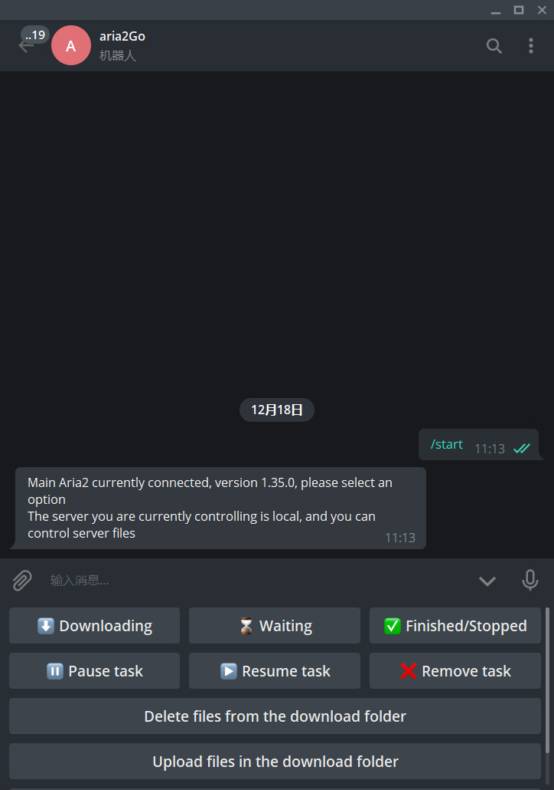
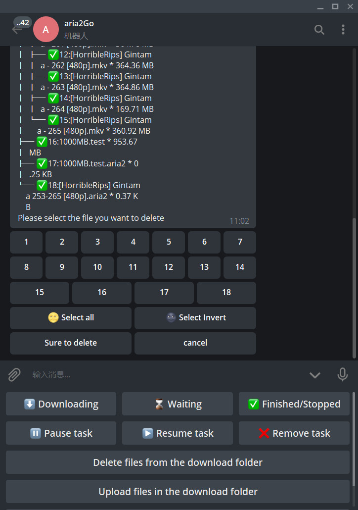
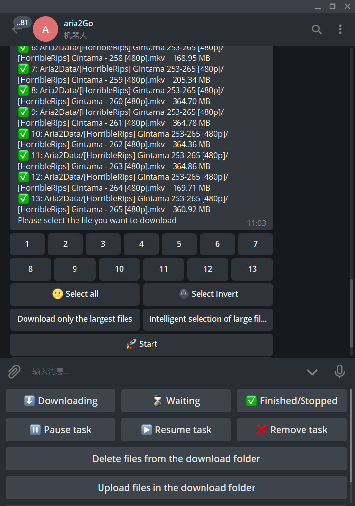
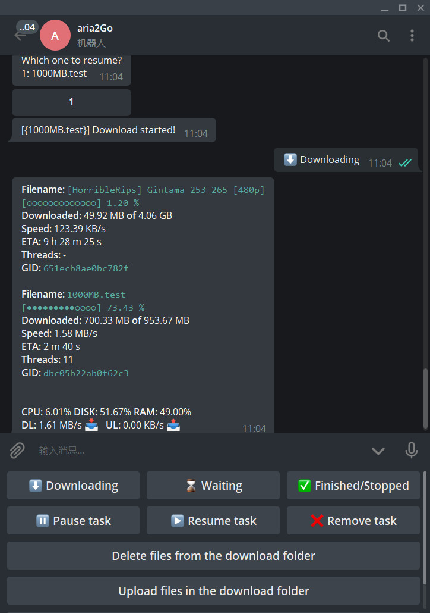

# DownloadBot

[](https://github.com/gaowanliang/DownloadBot/blob/master/go.mod)
[](https://github.com/gaowanliang/DownloadBot/releases/latest)
[](https://github.com/gaowanliang/DownloadBot/blob/master/LICENSE)
[](https://github.com/gaowanliang/DownloadBot/stargazers)
[](https://github.com/gaowanliang/DownloadBot/network/members)

(目前) 🤖 一個可以控制你的Aria2伺服器、控制伺服器檔，同時可以上傳到OneDrive的Telegram Bot。

## 意義

這個項目主要就是利用吃灰小盤vps進行離線下載，對於大bt檔進行根據硬碟大小分段下載，每次都下載一部分，然後上傳網盤，刪除再下載其他部分，直到下載完所有檔。

同時，通過機器人協議通信，方便在無法進行內網穿透的機器上進行使用，而且簡化了平時使用下載程式的操作，提高了便利性。對於連結，直接向Bot發送消息就可以直接識別並下載，可以真正刪除下載檔案夾裡的檔，是AriaNG等web面板無法做到的，作為管理下載的工具，及時通知下載完成都是非常的方便的。可以移動檔，對於通過rclone掛載硬碟的使用者可以直接通過本程式進行複製粘貼等操作，無需打開ssh連接VPS進行cp操作，也非常的方便。


## 實現

<text style="color:red;">**注意：本項目仍處於測試階段，提交的Release僅供測試，現在下載後並不保證您的穩定使用，也不能保證下面所勾選的內容已經被實現。當真正可以正常使用的時候，我會提交 V1.0 版本（V1.0 版本不會實現下面全部功能，但是已經可以正常穩定的使用）**</text>

#### 下載方式

- [x] Aria2 控制
  - [x] 持久化監控
  - [x] 斷線重連
- [ ] 多下載伺服器同時控制
  - [ ] 多伺服器之間通過有公網IP的伺服器進行WebSocket通信
  - [ ] 允許用戶建立公共WebSocket中繼端，供不方便建立WebSocket通信的用戶進行通信
  - [ ] 在heroku單獨部署WebSocket中繼端進行中繼
- [ ] [SimpleTorrent](https://github.com/boypt/simple-torrent) 控制
- [ ] qbittorrent 控制

#### 機器人協定支援

- [x] Telegram Bot
- [ ] 騰訊QQ（使用普通QQ用戶來進行交互）
- [ ] 釘釘機器人

#### 功能

- [x] 控制伺服器檔
    - [x] 刪除檔
    - [x] 移動文件
    - [ ] 壓縮檔
- [x] 下載檔案
    - [x] 下載 HTTP/FTP 連結
    - [x] 下載 Magnet 連結
    - [x] 下載 BitTorrent 文件內的文件
    - [x] 智慧 BitTorrent/Magnet 下載方式
        - [x] 只選擇下載最大的文件
        - [x] 根據檔大小智慧選擇檔，不選擇小文件
    - [ ] 自我調整環境存儲空間的 BitTorrent/Magnet 下載
        - [ ] 不下載超過存儲空間的檔
        - [ ] 根據存儲空間分塊多次下載 BitTorrent/Magnet 內的檔
    - [ ] 無感覺化的做種功能
      - [ ] 每次下載BitTorrent/Magnet檔後，保留最後一次下載的檔進行做種，直到下一次下載開始。
      - [ ] 可設置每次下載結束後強制做種一段時間
- [x] 上傳文件
    - [x] 下載完成後，向 OneDrive 上傳檔
      - [ ] 中斷點續傳
    - [x] 下載完成後，向 Google Drive 上傳檔
    - [ ] 下載完成後，向 Mega 上傳檔
    - [ ] 下載完成後，向 天翼網盤 上傳文件
    - [ ] (當使用Telegram進行通信時)下載完成後，向 Telegram 上傳檔
      - [ ] 當檔超過2GB時，分塊壓縮後再進行上傳
- [x] 附加其他功能
    - [x] 多語言支援
        - [x] 簡體中文
        - [x] 英語
        - [x] 繁體中文
        - [ ] 日語
    - [ ] 無人值守的BT站下載
        - [ ] Nyaa
        - [ ] ThePirateBay
    - [ ] 其他功能
        - [x] 檔樹輸出系統
            - [x] 對於簡單資料夾的文件樹輸出
            - [ ] 對於複雜資料夾結構使用圖片代替文字輸出
        - [ ] 通過演員ID獲取在DMM中使用的所有CID
        - [ ] 查詢 "ikoa"中的影片參數(利用mahuateng)
        - [ ] 通過javlibary演員網址獲得所有演員的編號。
        - [ ] 查詢dmm cid資訊、預覽影片、預覽圖片。
        - [ ] 在sukebei中按關鍵字搜索。
        - [ ] 根據關鍵字在dmm中搜索，最多30項。
        - [ ] 輸入dmm連結，列出所有專案。
        - [ ] 搜索當前dmm熱門和最新電影，限制30條(測試版)

## 目前特點

1. 完全基於觸摸，更容易使用，使用這個機器人基本不需要命令。
2. 即時通知，使用Aria2的Websocket協議進行通信。
3. 更好的設定檔支持。

## 開始

1. 通過 [@BotFather](https://telegram.me/botfather) 創建您自己的bot並使用。
2. （可選）您所在地區/國家的Telegram被封鎖？一定要有一個 **HTTP** proxy啟動並運行，您可以設置您的系統環境變數`HTTPS_PROXY`為代理位址來進行代理。
3. 下載本程式
4. 在想要執行本程式的根目錄配置`config.json`
5. 運行可執行檔

## 使用截圖

<div align="center">
    
</div>
<br>

<div align="center">
    </div>

## 設定檔示例

```json
{
  "aria2-server": "ws://127.0.0.1:5800/jsonrpc",
  "aria2-key": "xxxxxxxx",
  "bot-key": "123456789:xxxxxxxxx",
  "user-id": "123456789",
  "max-index": 10,
  "sign": "Main Aria2",
  "language": "zh-CN",
  "downloadFolder": "C:/aria2/Aria2Data",
  "moveFolder":"C:/aria2/GoogleDrive"
}
```

#### 各項對應解釋

* aria2-server：aria2伺服器位址，默認使用websocket連接。如果要使用websocket連接aria2，請務必設置`aria2.conf`內的`enable-rpc=true`
  。如果不是必須，請儘量設置本地的aria2位址，以便於最大化的使用本程式
* aria2-key：`aria2.conf`中`rpc-secret`的值
* bot-key：Telegram Bot的標識
* user-id：管理員的ID
* max-index：下載資訊最大顯示數量，建議10條（以後會改進）
* sign：此機器人的標識，如果需要多個伺服器連接同一個機器人，通過這一項可以確定具體是哪一台伺服器
* language：機器人輸出的語言
* downloadFolder：Aria2下載檔案保存的位址。如果不使用，請輸入`""`
* moveFolder： 要將下載檔案夾的文件移動到的資料夾。如果不使用，請輸入`""`

#### 目前支援的語言及語言標籤

| 語言     | 標籤  |
|----------|-------|
| 英語     | en    |
| 簡體中文 | zh-CN |
| 繁體中文 | zh-TW |

當您在`config.json`中填寫上面語言的標籤的時候，程式會自動下載語言包

#### 關於user-id

如果您不知道您的 `user-id` ，可以將此項留空，在運行這個機器人後輸入`/myid`，此機器人就會返回您的`user-id`.


